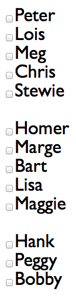
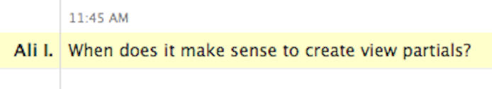

!SLIDE 
# Partial Views in Rails

!SLIDE
# Partial Views?

!SLIDE bullets incremental
# View?
* A view is a page that gets rendered in the browser

!SLIDE bullets incremental
# Partial View?

!SLIDE bullets incremental
# Partial!
* Part of the View

!SLIDE full-page

!SLIDE

!SLIDE
# Why?

!SLIDE

!SLIDE bullets incremental
# Jeff
### @jeffdallien
* When a part of the page is going to be reused in multiple views
* When looping is involved

!SLIDE bullets incremental
# Chris
### @eee_c
* I look at them like functions
* Extract whenever it would make sense to extract a function

!SLIDE
# When do YOU use partials?
